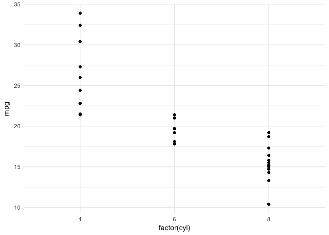

Using checkpoint to run old code using old packages
================
Billy Ehrenberg
10 July 2017

Suppose you want to make sure a fellow graphics nerd can use your scripts in the future even if all the R packages you used have been updated and the syntax changed?

Checkpoint is the answer.

Simply put, checkpoint is a way of making sure that the packages you use when you re-run an old script are the same as those used by the person who originally wrote it.

It doesn't require much code to run.

<h3>
Getting started
</h3>
Make sure when you write a new script you include a readMe file that has the date you finished the project. This will ensure anyone using the script in the future will be able to count on the same code achieving the same results - udates to packages can include changes to syntax etc.

I've added a readMe here, and it also includes some more detailed Checkpoint literature for anyone interested.

<h3>
Load the latest version of checkpoint and create the (invisible) checkpoint directory you need to store old packages
</h3>
This block might look scary, but it's quite simple. The if statement checks if checkpoint is loaded. If it isn't, it installs the latest version and then laods it.

Then it checks if the directory '.checkpoint' exists, and, if it doesn't, creates it. This directory is where the old packages will be stored so yoiu can re-run the old script.

``` r
if(!require(checkpoint)) {
 install.packages('checkpoint')
  require(checkpoint)
}

if(!dir.exists("~/.checkpoint")){
  dir.create("~/.checkpoint")
}
```

<h3>
Loading libraries from the past
</h3>
The next step is to work out what packages are being used by the project and load the versions of the packages as they were on the date the project was written.

To do this we use the checkpoint function. It takes three arguments we need to worry about. The date you want to load packages from (snapshotDate), the path to the project (folder/subfolder\_containing\_Rproj\_file) and whether to scan for packages.

Scanning for packages is the clever bit: it will scan your project for you, working out what projects you used and then loading the versions of them for the date you give it!

Let's set these options to work for the example. As I'm running this code inside the project folder, I can use getwd() to simply return the path of the folder I'm in, as that is also where the project is.

I'd recommend copying and loading the project you're working on, so you aren't jumping between directories. You can, however, manually enter the path if you prefer.

The date of my project was the date I found in the readMe for this project.

``` r
project.path <- getwd()

date_of_proj <- "2017-07-10"
```

Now we can run our code to check for and then load packages:

``` r
checkpoint(snapshotDate = date_of_proj,
           project = project.path, verbose = T,
           scanForPackages = T)
```

And voila, we can now run our script as if it was 10 June 2017!

``` r
mtcars %>% 
  ggplot(aes(
    factor(cyl),mpg
  ))+
    geom_point()+
    theme_minimal()
```


